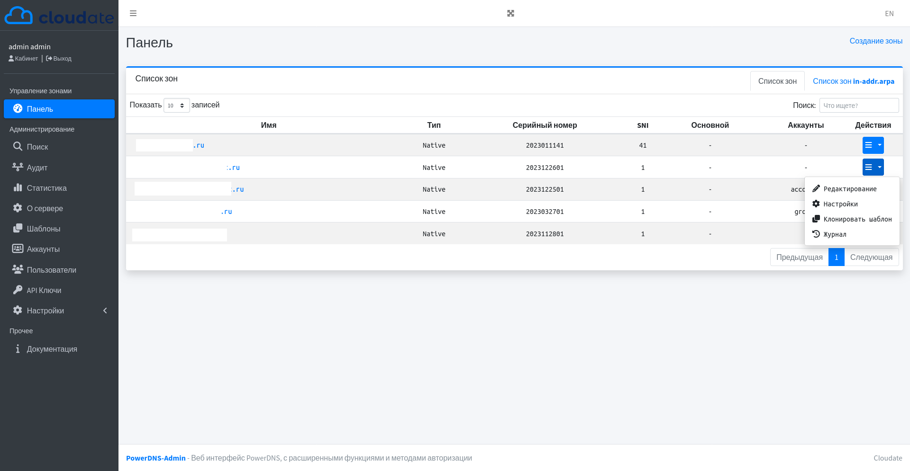

# PowerDNS-Admin

Веб-интерфейс PowerDNS с расширенными функциями

#### Функции:

- Обеспечивает прямое и обратное управление зонами
- Предоставляет функции создания шаблонов зон
- Обеспечивает управление пользователями с контролем доступа на основе ролей
- Обеспечивает контроль доступа для конкретной зоны
- Обеспечивает ведение журнала действий
- Аутентификация:
   - Поддержка локальных пользователей
   - Поддержка SAML
- Настройка службы DNS и мониторинг статистики
- Предоставляет API для управления зонами и записями среди других функций
- Обеспечивает полную поддержку IDN/Punycode

## Запуск PowerDNS-Admin

There are several ways to run PowerDNS-Admin. The quickest way is to use Docker.
If you are looking to install and run PowerDNS-Admin directly onto your system, check out
the [wiki](https://github.com/PowerDNS-Admin/PowerDNS-Admin/blob/master/docs/wiki/) for ways to do that.

#### Установка: среды разработки
```bash
$ poetry add $(cat requirements.txt| xargs)
$ make init
$ make run 
```

#### Помощь в переводе
Редактируем файлы powerdnsadmin/template/*.html 

  Пример 
```html
<p>Dashboard</p> -> <p>{{_('Dashboard')}}</p>
```
В проекте
```bash
$ make babel-extract # Извлечение слов
$ make babel-update # Обновление файла powerdnsadmin/translations/ru/LC_MESSAGES/messages.po
# Указываем перевод слова в messages.po после msgstr
$ make babel-compile # Создать словарь
```

Затем вы можете получить доступ к PowerDNSAdmin, указав в своем браузере на http://localhost:9191

### Скриншот Панели
